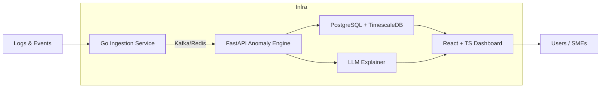

# 🔐 SentinelAI: Real-Time Threat Detection & Response Platform

A modern, autonomous cybersecurity dashboard built for small/medium enterprises (SMEs) that demonstrates real-time systems, AI integration, microservices architecture, and full-stack development skills.

## 📚 What I Learned

This project helped me master critical enterprise-level software engineering concepts:

- 🏗️ **Microservices Architecture** - Designing distributed systems with proper service boundaries and communication patterns
- ⚡ **Real-time Systems** - WebSocket implementation, event streaming, and high-throughput data ingestion
- 🤖 **AI/ML Integration** - LLM-powered threat explanations, anomaly detection, and RAG systems
- 🔒 **Security Engineering** - Zero-trust architecture, RBAC, authentication flows, and security best practices
- 🚀 **DevOps & Infrastructure** - Kubernetes, Docker, Terraform, CI/CD pipelines, and observability
- 📊 **Time-series Data** - TimescaleDB for high-volume log storage and efficient querying
- 🛠️ **CLI Development** - Building developer-friendly command-line tools for DevSecOps workflows
- 📈 **Observability** - Prometheus metrics, Grafana dashboards, and structured logging

## 🧱 Project Structure

```
SentinelAI/
├── frontend/                       # React + TypeScript dashboard
│   ├── src/components/            # Dashboard components
│   ├── src/websockets/            # Real-time WebSocket integration
│   └── package.json               # Frontend dependencies
├── backend/
│   ├── ingestion/                 # Go microservice for log ingestion
│   ├── ml-engine/                 # FastAPI ML anomaly detection
│   └── auth-service/              # Authentication & authorization
├── cli/
│   └── sentinelctl/               # Command-line tool
├── infra/
│   ├── terraform/                 # Infrastructure as code
│   ├── k8s/                       # Kubernetes manifests
│   └── docker-compose.yml         # Local development setup
├── docs/
│   └── architecture.md            # System design documentation
└── README.md                      # Project overview
```

## 📦 Tech Stack & Dependencies

**Frontend:**
- React 18 + TypeScript
- Tailwind CSS + shadcn/ui
- WebSocket for real-time updates
- Auth0/Keycloak for OIDC authentication

**Backend:**
- Go 1.21+ (ingestion service)
- Python 3.11+ + FastAPI (ML engine)
- PostgreSQL + TimescaleDB
- Redis/Kafka for event queuing

**AI/ML:**
- OpenAI API / Mistral
- Custom anomaly detection models
- RAG for CVE lookups

**Infrastructure:**
- Docker + Kubernetes
- Terraform (AWS/GCP)
- Prometheus + Grafana
- GitHub Actions

## 🔨 How to Build and Run

1. **Local Development Setup:**
   ```bash
   git clone https://github.com/avipdas/SentinelAI.git
   cd SentinelAI
   docker compose up -d
   ```

2. **Start Observability Stack:**
   ```bash
   docker compose -f docker-compose.observability.yml up -d
   # Prometheus: http://localhost:9090
   # Grafana: http://localhost:3000
   ```

3. **Run Frontend Dashboard:**
   ```bash
   cd frontend
   npm install
   npm run dev
   # Dashboard: http://localhost:3000
   ```

4. **Test CLI Tool:**
   ```bash
   ./cli/sentinelctl ingest --file sample_logs.json
   ./cli/sentinelctl watch --alerts
   ```

## 🏗️ Architecture Overview



## ⚡ Core Features

**Real-Time Threat Detection:**
- Autonomous anomaly detection across cloud accounts, endpoints, and internal apps
- Uses LLMs + fine-tuned models to classify and explain threats
- Auto-generates firewall rules or RBAC policies as defense suggestions
- Includes an internal zero-trust authorization mesh for microservices
- Runs both on-prem and in the cloud, with mobile alerting

**Why It Solves a Real Problem:**
- SMEs are the most vulnerable and underserved in security
- Shows mastery across frontend, backend, real-time systems, AI, and infrastructure
- Demonstrates understanding of security, systems design, scaling, and usability
- Highlights original thinking and builder mentality

## 💻 CLI Usage (`sentinelctl`)

```bash
# Install CLI
go install github.com/avipdas/SentinelAI/cli/sentinelctl@latest

# Basic commands
sentinelctl login --auth-url https://your-auth0-domain.com
sentinelctl ingest --file sample_logs.json
sentinelctl watch --alerts
sentinelctl export --format slack --webhook-url https://hooks.slack.com/...
sentinelctl generate-report --period weekly --format pdf
```

## 🔥 Bonus Features

- **CLI tool (`sentinelctl`)** for integration with developer workflows
- **Browser extension** to detect suspicious cookie/session behavior
- **Built-in security playground** to simulate attacks for testing
- **PDF reports** auto-generated with LLM summaries of weekly alerts
- **Export integrations**: Slack, PagerDuty, Discord, Syslog

## 🗓️ 8-Week Development Roadmap

### Week 1: Project Setup & Architecture
- Define MVP: Ingest system logs, detect anomalies, show alert dashboard
- Architect system: draw a full diagram (ingestion, storage, ML, dashboard, CLI)
- Set up GitHub repo + issues + Kanban
- Monorepo (Nx or Turborepo) or service folders
- Docker + Docker Compose for all services
- Terraform scaffolding for cloud (start with AWS or local Docker Swarm)
- Choose your LLM model for RAG or explanation

### Week 2: Real-Time Log Ingestion System
- Build log ingestion microservice (Go)
- Accept syslog or HTTP logs
- Stream into Redis/Kafka
- Start storing logs in TimescaleDB
- Add CLI (`sentinelctl ingest`) to simulate logs
- Unit test ingestion logic
- WebSocket mock data to frontend

### Week 3: Basic Dashboard UI
- Set up React dashboard (Next.js if needed)
- Pages: Real-time alerts (WebSocket), Search logs, Alert detail
- Tailwind + DaisyUI or shadcn/ui for polish
- Add login screen (Auth0 or Keycloak)
- Test deploy frontend + backend locally

### Week 4: Anomaly Detection Engine
- FastAPI microservice for analyzing logs
- Simple baseline: frequency-based anomaly
- Add PUT /analyze and GET /alerts
- Add background job to scan recent logs
- Trigger alerts in DB + WebSocket
- Unit test analyzer

### Week 5: LLM Integration + Explanations
- Use OpenAI or HuggingFace LLM to explain threats
- Prompt with alert metadata
- Output natural-language summary
- Add explanation UI in dashboard
- Build a RAG system (if you want to go deeper)
- Output report to /report.pdf

### Week 6: CLI + Auth + Exporting
- Enhance sentinelctl: login, put, get, watch, export
- Add API rate-limiting + API key support
- Add Slack/Discord webhook exporters
- Add JWT or OAuth for authenticated APIs
- CLI unit tests

### Week 7: Hardening + Observability
- Add Prometheus metrics + Grafana dashboard
- Add structured logging (Zap or Winston)
- Add circuit breakers (e.g., with resilience4j)
- Setup GitHub Actions CI/CD
- Deploy to AWS/GCP or use local k8s (k3d)

## 🧪 Testing Strategy

**Unit Tests:**
- Go ingestion service with test coverage
- FastAPI ML engine endpoints
- React component testing with Jest/RTL
- CLI command testing

**Integration Tests:**
- End-to-end WebSocket flow
- Database integration tests
- API contract testing

**Performance Tests:**
- Load testing log ingestion
- WebSocket connection limits
- Database query optimization

## 📊 Observability & Monitoring

**Metrics (Prometheus):**
- Log ingestion rate
- Anomaly detection latency
- WebSocket connection count
- API response times

**Dashboards (Grafana):**
- System health overview
- Threat detection metrics
- User activity monitoring
- Infrastructure resource usage

**Alerting:**
- High anomaly detection rate
- System component failures
- Security threshold breaches

## 🚀 Deployment Options

### Local Development
```bash
docker-compose up -d
```

### Kubernetes Production
```bash
helm install sentinelai ./infra/k8s/helm-chart/
```

### Cloud (Terraform)
```bash
cd infra/terraform
terraform init
terraform plan
terraform apply
```

## ✨ Future Enhancements

- **Advanced ML Models**: Implement transformer-based anomaly detection
- **Multi-tenant Support**: Add organization isolation and role-based access
- **Mobile App**: Native iOS/Android app for security teams
- **Compliance Reporting**: SOC 2, ISO 27001 automated compliance checks
- **Threat Intelligence**: Integration with external threat feeds
- **Incident Response**: Automated playbook execution
- **Advanced Analytics**: Machine learning-driven security insights

## 🤝 Contributing

Pull requests welcome! For major changes, please open an issue first to discuss proposed changes.

## 📜 License

MIT License © 2025 Avi Das

---

## 🙌 Final Thoughts

SentinelAI showcases the intersection of cybersecurity, AI, and modern software engineering. This project demonstrates proficiency in building scalable, real-time systems that solve genuine business problems while incorporating cutting-edge technologies like LLMs, microservices, and cloud-native infrastructure.

The 8-week development approach proves the ability to break down complex systems, prioritize features, and deliver a production-ready solution with proper testing, observability, and deployment automation.
